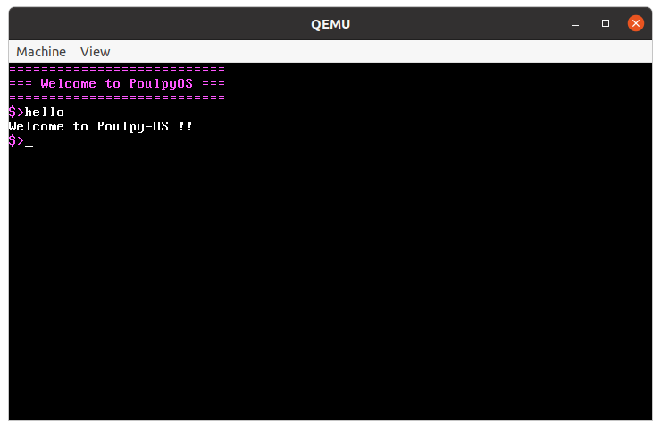
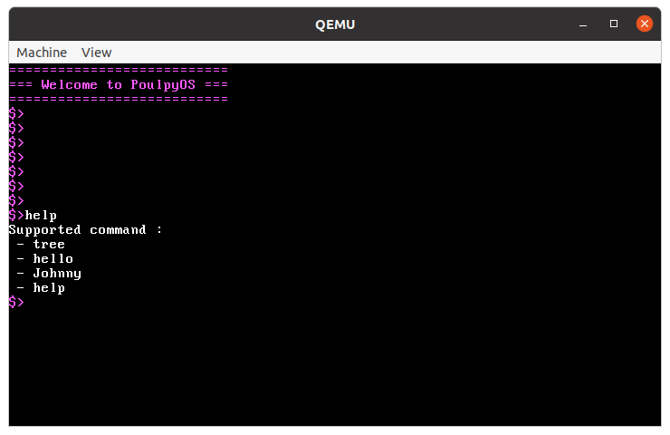

[](https://opensource.org/licenses/MIT) <br>
 <br>

## Description
A toy OS for learning <br>
 


## Testing only
```console
user@debian:~$ sudo apt update
user@debian:~$ sudo apt install qemu qemu-system-x86
user@debian:~$ make run
```
  
## Compiling for dev
```console
user@debian:~$ make debug
```


## Todo List
- [x] Booting to 16 bits mode
- [x] Booting to 32 bits mode
- [x] Loading kernel and basic drivers
- [ ] Avoid pulling on input buffer driver
- [x] Basic Shell
- [x] Secret command
- [ ] Window manager
- [ ] Better timing for the clock based
- [ ] Support exporting to ISO file


## Resources and useful links
- https://wiki.osdev.org/Expanded_Main_Page
- https://github.com/cfenollosa/os-tutorial
- http://www.osdever.net/FreeVGA/vga/crtcreg.htm
- https://www.cs.bham.ac.uk/~exr/lectures/opsys/10_11/lectures/os-dev.pdf ( <- Best one )


Crafted with :heart: by mtribiere
